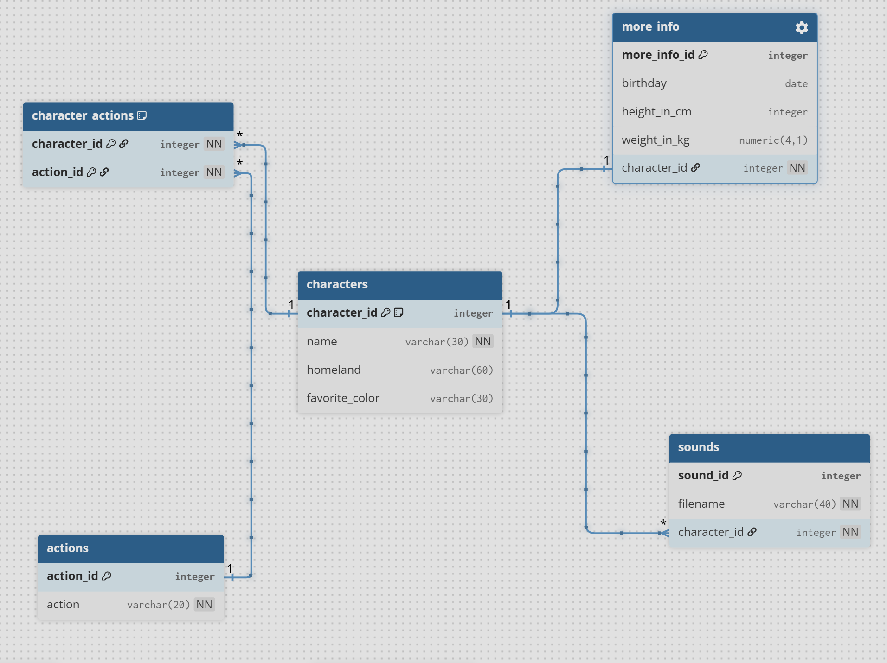

# 🍄 Mario Video Game Database (SQL/PostgreSQL)

A relational database engineered to manage character data, game-state actions, and sound assets. This project demonstrates the transition from flat-file data storage to a fully normalized relational schema.

## 📊 Database Architecture

### 🏗️ Key Features
- **Normalization:** Implemented 1:1, 1:Many, and Many-to-Many relationships.
- **Junction Tables:** Engineered the `character_actions` table with a composite primary key to map complex character-action interactions.
- **Data Integrity:** Enforced strict constraints including `FOREIGN KEY` references, `UNIQUE` indices, and `NOT NULL` requirements.
- **Scalability:** Built using `SERIAL` sequences for automated ID generation.

## 🛠️ Tech Stack
- **Database:** PostgreSQL
- **Environment:** Bash / Linux Terminal
- **Version Control:** Git & GitHub
- **Visual Design:** DBML (dbdiagram.io)

## 📂 Project Highlights
The core of this project was moving beyond simple tables and into **Referential Integrity**. By separating character statistics (`more_info`) and voice assets (`sounds`) into dedicated tables, I've created a structure that prevents data redundancy and ensures a "Single Source of Truth."

---
*Completed as part of the freeCodeCamp Relational Database Certification.*
